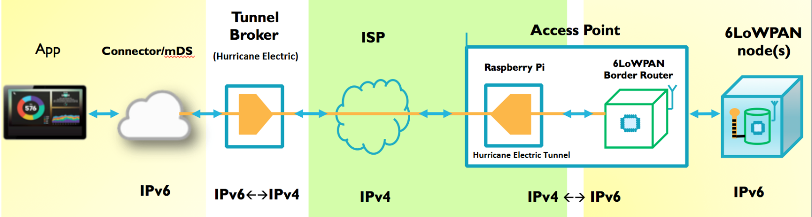
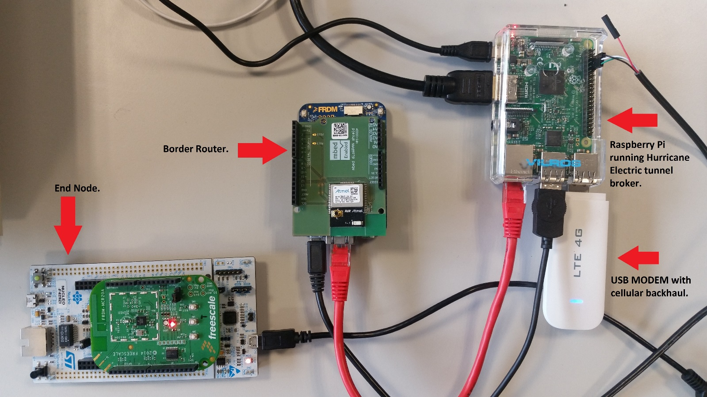
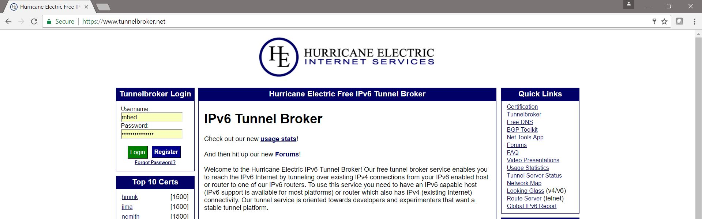
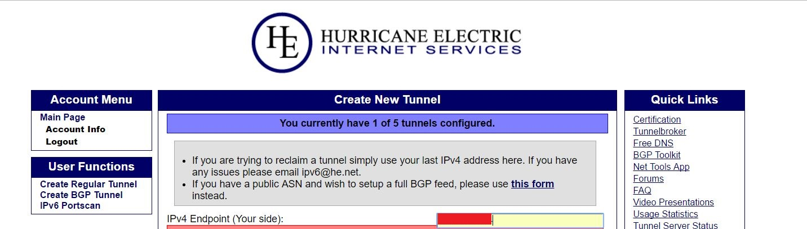
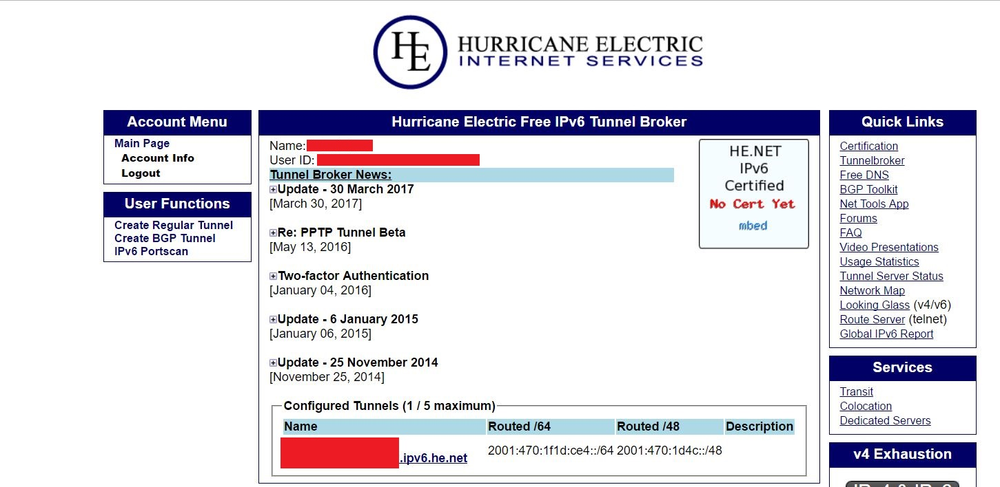
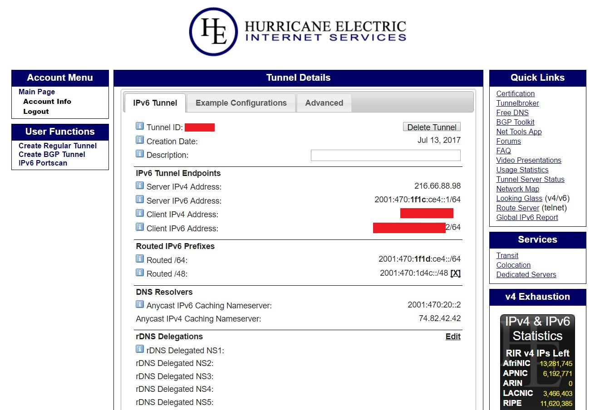

How to setup Hurricane Electric for IPv6/IPv4 tunnel on Raspberry Pi:
=====================================================================

Note: This document is a ***basic tutorial only***, for detailed
instructions/troubleshooting, please get in touch on GitHub. We are
happy to receive your PR's.

A major requirement for this setup to be operational is to have a public
static IP address for your chosen backhaul network.

Purpose of the tunnel broker:
-----------------------------

**The problem:** For 6LoWPAN / Thread networks to be operational with
public web services, a requirement is the availability of IPv6 backhaul
networks to internet. However, due to the slow deployment and adoption
of the IPv6 addresses, many ISP are not able to provide native IPv6
support, and hence limiting the possibility of connecting 6LoWPAN based
devices directly to internet.

**One Solution:** Use a tunnel broker to encapsulate IPv4 traffic into
IPv6 and vice-versa.

**This setup uses the following model:**

The proposed setup uses a USB modem and a cellular backhaul with a fixed
and public IPv4 address provided by the ISP. This is required to allow
incoming traffic from the HE tunnel broker to reach the IPv6 devices.

A sample setup looks like the below:

Hardware required:
------------------

1.  Raspberry Pi 3, model B.

2.  Power supply (5V, &gt;2A).

3.  USB MODEM compatible with a RPi - The choice of modem is very
    important as it must NOT do any NAT / firewalling. We are using a
    Chinese made LTE USB modem with Siemens SG75 chip. Latest models
    seem to be using Qualcomm 9200 / 9500. \[[Product
    link](https://www.aliexpress.com/item/4G-LTE-100Mbps-USB-Modem-Network-Adapter-with-WiFi-Antenna-Hotspot-For-Win-XP-Vista-7/32810949702.html?spm=2114.search0104.3.138.PVl54K&ws_ab_test=searchweb0_0,searchweb201602_1_10152_10065_10151_10068_10130_10209_10192_10190_10301_10137_10303_10060_10155_438_10154_10056_10055_10054_10059_100031_10099_10103_10102_10052_10053_10142_10107_10050_10051_9985_10084_10083_10080_10082_10081_10110_10111_10112_10113_10114_10179_10182_10184_10078_10079_10210_10073_10189-10052_9985_10111,searchweb201603_16,ppcSwitch_4&btsid=90dde5d9-16d3-4b1f-9af4-1f4af205a0ad&algo_expid=3c5f0590-4082-4386-b08a-d9d63f18dc0c-18&algo_pvid=3c5f0590-4082-4386-b08a-d9d63f18dc0c)\]

4.  SIM card with a fixed/public IPv4 address mobile connection. For
    example, in the UK, one of the mobile network operators that offers
    fixed/public IPv4 address is [Comms365
    Ltd](https://www.comms365.com/fixedipsims/). You may use any
    provider in your region who can provide a static public IP address.

5.  One of the supported mbed Border Routers, whether is 2.4GHz or
    Sub-Ghz: <https://github.com/ARMmbed/nanostack-border-router>

6.  An end node – to test complete setup. This is your choice!

SW required:
------------

-   Raspbian Jessie installed on the SD card for the Pi.

-   wvdial for the connection dialler.

-   An account and a regular tunnel created on Hurricane Electric – For
    this there is a need of static public IP assigned from your ISP. In
    this case, we have a static public IP (137.221.10.4) assigned from
    the mobile operator. The Hurricane Electric tunnel is created based
    on this IP address.

Steps:
------

-   Make sure Raspbian Jessie is up to date with apt-get update/upgrade.

-   Install wvdial.

sudo apt-get install wvdial

-   Make a dial config file if not already available at
    “/etc/wvdial.conf” with following details:

\[Dialer comms\]

> Init1 = ATZ
>
> Init2 = ATQ0 V1 E1 +FCLASS=0
>
> Init3 = AT+CGDCONT=1, "IP","&lt;your APN here&gt;"
>
> Phone = \*99\#
>
> Auto DNS = on
>
> \#Modem Type = Analog Modem
>
> Stupid mode = 1
>
> Baud = 460800
>
> New PPPD = yes
>
> Dial Command = ATDT
>
> Modem = /dev/ttyUSB1
>
> ISDN = 0
>
> Username = &lt;your ISP supplied username here&gt;
>
> Password = &lt;your ISP supplied password here&gt;
>
> Carrier Check = yes

You may also need to change your serial device (ttyUSB1) based on your
system. However, in most cases, USB1 should be good to go.

-   The details for the username and password may be provided by the
    mobile operator. Most of other details are a set of AT commands to
    operate the modem.

-   Plug in the USB modem to a free USB port on the RPi and make sure it
    is detected with “lsusb”:

> root@raspberrypi:~\# lsusb
>
> Bus 001 Device 006: ID 05c6:6000 Qualcomm, Inc. Siemens SG75
>
> Bus 001 Device 004: ID 0e8f:0022 GreenAsia Inc.
>
> Bus 001 Device 003: ID 0424:ec00 Standard Microsystems Corp.
> SMSC9512/9514 Fast Ethernet Adapter
>
> Bus 001 Device 002: ID 0424:9514 Standard Microsystems Corp.
>
> Bus 001 Device 001: ID 1d6b:0002 Linux Foundation 2.0 root hub
>
> root@raspberrypi:~\#

Note the USB modem is detected as 05c6:6000 Qualcomm Inc. Siemens SG75

-   Then on the terminal, start the dialler to create the connection:

sudo wvdial comms

The dialler starts with a set of AT commands to the modem and then
establishes the connection to the ISP. When this is successful, it will
obtain an IP address for the SIM. This indicates a successful
connection. Also, on the modem that has been used, the LED starts to
flash BLUE when the connection is established. This also serves as a
visual indication for successful connection.

> root@raspberrypi:~\# wvdial comms
>
> --&gt; WvDial: Internet dialer version 1.61
>
> --&gt; Initializing modem.
>
> --&gt; Sending: ATZ
>
> ATZ
>
> OK
>
> --&gt; Sending: ATQ0 V1 E1 +FCLASS=0
>
> ATQ0 V1 E1 +FCLASS=0
>
> OK
>
> --&gt; Sending: AT+CGDCONT=1, "IP","comms365.o2.com"
>
> AT+CGDCONT=1, "IP","comms365.o2.com"
>
> OK
>
> --&gt; Modem initialized.
>
> --&gt; Sending: ATDT\*99\#
>
> --&gt; Waiting for carrier.
>
> ATDT\*99\#
>
> CONNECT 100000000
>
> --&gt; Carrier detected. Starting PPP immediately.
>
> --&gt; Starting pppd at Thu Jul 20 16:59:06 2017
>
> --&gt; Pid of pppd: 1071
>
> --&gt; Using interface ppp0
>
> --&gt; pppd: ▒Q▒v8Ĩ\[01\]▒è\[01\]
>
> --&gt; pppd: ▒Q▒v8Ĩ\[01\]▒è\[01\]
>
> --&gt; pppd: ▒Q▒v8Ĩ\[01\]▒è\[01\]
>
> --&gt; pppd: ▒Q▒v8Ĩ\[01\]▒è\[01\]
>
> --&gt; pppd: ▒Q▒v8Ĩ\[01\]▒è\[01\]
>
> --&gt; local IP address 10.254.10.4
>
> --&gt; pppd: ▒Q▒v8Ĩ\[01\]▒è\[01\]
>
> --&gt; remote IP address 10.64.64.64
>
> --&gt; pppd: ▒Q▒v8Ĩ\[01\]▒è\[01\]
>
> --&gt; primary DNS address 5.226.60.162
>
> --&gt; pppd: ▒Q▒v8Ĩ\[01\]▒è\[01\]
>
> --&gt; secondary DNS address 5.226.56.162
>
> --&gt; pppd: ▒Q▒v8Ĩ\[01\]▒è\[01\]

-   Once connected, a local IP & DNS should be shown as above. It’s
    possible to check the system logs to track progress of the
    connection using the following command:

> tail -f /var/log/messages

An example of system log messages is shown below.

Note that it may take a few attempts to establish a successful
connection depending on the location of the modem and the signal
strength of the carrier / network coverage of the provider that has been
chosen.

> Jul 17 11:47:20 raspberrypi pppd\[2013\]: pppd 2.4.6 started by root,
> uid 0
>
> Jul 17 11:47:20 raspberrypi pppd\[2013\]: Using interface ppp0
>
> Jul 17 11:47:20 raspberrypi pppd\[2013\]: Connect: ppp0 &lt;--&gt;
> /dev/ttyUSB1
>
> Jul 17 11:47:20 raspberrypi pppd\[2013\]: CHAP authentication
> succeeded
>
> Jul 17 11:47:20 raspberrypi pppd\[2013\]: CHAP authentication
> succeeded
>
> Jul 17 11:47:20 raspberrypi pppd\[2013\]: Could not determine remote
> IP address: defaulting to 10.64.64.64
>
> Jul 17 11:47:20 raspberrypi pppd\[2013\]: local IP address 10.254.10.4
>
> Jul 17 11:47:20 raspberrypi pppd\[2013\]: remote IP address
> 10.64.64.64
>
> Jul 17 11:47:20 raspberrypi pppd\[2013\]: primary DNS address
> 5.226.60.162
>
> Jul 17 11:47:20 raspberrypi pppd\[2013\]: secondary DNS address
> 5.226.56.162

-   Go to Hurricane Electric website and login with your account.

-   After login, click on “create regular tunnel” on the left hand pane
    and enter the static + public IP obtained from the ISP. **Hurricane
    electric will then try to ping the device and if successful, will
    return the tunnel configuration as below. For this to work, you need
    to have a public, static IP from your ISP.**

Configure the tunnel with the local IP as shown below:

The following image shows an example of tunnel information that is being
used:

Clicking on the tunnel’s name brings up more detials that will be used
for the network interface configuration. This is shown below.

Use this configuration for the Hurricane Electric interface
configuration in /etc/network/interfaces.

TIP: An example of the configuration to be used for the network
interface is provided by Hurricane Electric under the “Example
configurations” tab in the tunnel details page.

-   Use these details to create the network interface i.e. the
    he-ipv6 interface.

> root@raspberrypi:~\# cat /etc/network/interfaces
>
> \# interfaces(5) file used by ifup(8) and ifdown(8)
>
> \# Please note that this file is written to be used with dhcpcd
>
> \# For static IP, consult /etc/dhcpcd.conf and 'man dhcpcd.conf'
>
> \# Include files from /etc/network/interfaces.d:
>
> source-directory /etc/network/interfaces.d
>
> auto lo
>
> iface lo inet loopback
>
> \#The USB modem
>
> allow-hotpulug ppp0
>
> iface ppp0 inet dhcp
>
> dns-nameservers 8.8.8.8 8.8.4.4
>
> \#For forwarding traffic from USB to ETH
>
> \#iface eth0 inet dhcp
>
> auto eth0
>
> iface eth0 inet static
>
> address 10.90.90.1
>
> netmask 255.255.255.0
>
> allow-hotplug wlan0
>
> iface wlan0 inet manual
>
> wpa-conf /etc/wpa\_supplicant/wpa\_supplicant.conf
>
> auto he-ipv6
>
> iface he-ipv6 inet6 v4tunnel
>
> address 2001:470:1f1c:ce4::2
>
> netmask 64
>
> endpoint 216.66.88.98
>
> local &lt;Your local IP address assigned from wvdial&gt;
>
> ttl 255
>
> gateway 2001:470:1f1c:ce4::1
>
> up ip addr add 2001:470:1d4c:1::1/64 dev eth0
>
> up sysctl -p
>
> up service radvd.start
>
> up /etc/ip6tables.up.rules
>
> allow-hotplug wlan1
>
> iface wlan1 inet manual
>
> wpa-conf /etc/wpa\_supplicant/wpa\_supplicant.conf
>
> root@raspberrypi:~\#

-   Restart the networking service with the following command on the
    terminal:

> sudo /etc/init.d/networking restart

-   Ping google.com / bbc.co.uk / facebook.com to make sure you have
    IPv4 connectivity. Once this is OK, you should have another
    interface in ifconfig called ppp0.

> root@raspberrypi:~\# ping google.com
>
> PING google.com (216.58.206.142) 56(84) bytes of data.
>
> 64 bytes from lhr25s15-in-f14.1e100.net (216.58.206.142): icmp\_seq=1
> ttl=45 time=106 ms
>
> 64 bytes from lhr25s15-in-f14.1e100.net (216.58.206.142): icmp\_seq=2
> ttl=45 time=78.6 ms
>
> 64 bytes from lhr25s15-in-f14.1e100.net (216.58.206.142): icmp\_seq=3
> ttl=45 time=105 ms
>
> 64 bytes from lhr25s15-in-f14.1e100.net (216.58.206.142): icmp\_seq=4
> ttl=45 time=88.6 ms
>
> 64 bytes from lhr25s15-in-f14.1e100.net (216.58.206.142): icmp\_seq=5
> ttl=45 time=68.1 ms
>
> 64 bytes from lhr25s15-in-f14.1e100.net (216.58.206.142): icmp\_seq=6
> ttl=45 time=57.5 ms
>
> 64 bytes from lhr25s15-in-f14.1e100.net (216.58.206.142): icmp\_seq=7
> ttl=45 time=124 ms
>
> 64 bytes from lhr25s15-in-f14.1e100.net (216.58.206.142): icmp\_seq=8
> ttl=45 time=75.7 ms
>
> ^C
>
> --- google.com ping statistics ---
>
> 8 packets transmitted, 8 received, 0% packet loss, time 7003ms
>
> rtt min/avg/max/mdev = 57.560/88.247/124.674/21.132 ms

-   Now, **ping6** google.com or bbc.co.uk or facebook.com to make sure
    the tunnel is working.

> root@raspberrypi:~\# ping6 -c 10 google.com
>
> PING google.com(lhr25s15-in-x0e.1e100.net) 56 data bytes
>
> 64 bytes from lhr25s15-in-x0e.1e100.net: icmp\_seq=1 ttl=57 time=519
> ms
>
> 64 bytes from lhr25s15-in-x0e.1e100.net: icmp\_seq=2 ttl=57 time=499
> ms
>
> 64 bytes from lhr25s15-in-x0e.1e100.net: icmp\_seq=3 ttl=57 time=439
> ms
>
> 64 bytes from lhr25s15-in-x0e.1e100.net: icmp\_seq=4 ttl=57 time=419
> ms
>
> 64 bytes from lhr25s15-in-x0e.1e100.net: icmp\_seq=5 ttl=57 time=419
> ms
>
> 64 bytes from lhr25s15-in-x0e.1e100.net: icmp\_seq=6 ttl=57 time=499
> ms
>
> 64 bytes from lhr25s15-in-x0e.1e100.net: icmp\_seq=7 ttl=57 time=419
> ms
>
> 64 bytes from lhr25s15-in-x0e.1e100.net: icmp\_seq=8 ttl=57 time=399
> ms
>
> 64 bytes from lhr25s15-in-x0e.1e100.net: icmp\_seq=9 ttl=57 time=439
> ms
>
> 64 bytes from lhr25s15-in-x0e.1e100.net: icmp\_seq=10 ttl=57 time=429
> ms
>
> --- google.com ping statistics ---
>
> 10 packets transmitted, 10 received, 0% packet loss, time 9208ms
>
> rtt min/avg/max/mdev = 399.306/448.511/519.452/39.691 ms
>
> root@raspberrypi:~\# ping6 -c 5 facebook.com
>
> PING facebook.com(edge-star-mini6-shv-01-amt2.facebook.com) 56 data
> bytes
>
> 64 bytes from edge-star-mini6-shv-01-amt2.facebook.com: icmp\_seq=1
> ttl=57 time=549 ms
>
> 64 bytes from edge-star-mini6-shv-01-amt2.facebook.com: icmp\_seq=2
> ttl=57 time=549 ms
>
> 64 bytes from edge-star-mini6-shv-01-amt2.facebook.com: icmp\_seq=3
> ttl=57 time=688 ms
>
> 64 bytes from edge-star-mini6-shv-01-amt2.facebook.com: icmp\_seq=4
> ttl=57 time=509 ms
>
> 64 bytes from edge-star-mini6-shv-01-amt2.facebook.com: icmp\_seq=5
> ttl=57 time=510 ms
>
> --- facebook.com ping statistics ---
>
> 5 packets transmitted, 5 received, 0% packet loss, time 4468ms
>
> rtt min/avg/max/mdev = 509.854/561.561/688.526/65.861 ms
>
> root@raspberrypi:~\#

-   Monitor the packets Tx/Rx on ppp0 and he-ipv6 interface to make sure
    packets are being sent out and received.

> root@raspberrypi:~\# ifconfig
>
> eth0 Link encap:Ethernet HWaddr b8:27:eb:2a:d2:36
>
> inet addr:10.90.90.1 Bcast:10.90.90.255 Mask:255.255.255.0
>
> inet6 addr: fe80::4e85:b5d0:20a7:fab6/64 Scope:Link
>
> inet6 addr: 2001:470:1d4c:1::1/64 Scope:Global
>
> UP BROADCAST MULTICAST MTU:1500 Metric:1
>
> RX packets:0 errors:0 dropped:0 overruns:0 frame:0
>
> TX packets:0 errors:0 dropped:0 overruns:0 carrier:0
>
> collisions:0 txqueuelen:1000
>
> RX bytes:0 (0.0 B) TX bytes:0 (0.0 B)
>
> he-ipv6 Link encap:IPv6-in-IPv4
>
> inet6 addr: 2001:470:1f1c:ce4::2/64 Scope:Global
>
> inet6 addr: fe80::afe:a04/64 Scope:Link
>
> UP POINTOPOINT RUNNING NOARP MTU:1480 Metric:1
>
> RX packets:26 errors:0 dropped:0 overruns:0 frame:0
>
> TX packets:29 errors:22 dropped:0 overruns:0 carrier:22
>
> collisions:0 txqueuelen:1
>
> RX bytes:2616 (2.5 KiB) TX bytes:2904 (2.8 KiB)
>
> lo Link encap:Local Loopback
>
> inet addr:127.0.0.1 Mask:255.0.0.0
>
> inet6 addr: ::1/128 Scope:Host
>
> UP LOOPBACK RUNNING MTU:65536 Metric:1
>
> RX packets:471 errors:0 dropped:0 overruns:0 frame:0
>
> TX packets:471 errors:0 dropped:0 overruns:0 carrier:0
>
> collisions:0 txqueuelen:1
>
> RX bytes:39788 (38.8 KiB) TX bytes:39788 (38.8 KiB)
>
> ppp0 Link encap:Point-to-Point Protocol
>
> inet addr:10.254.10.4 P-t-P:10.64.64.64 Mask:255.255.255.255
>
> UP POINTOPOINT RUNNING NOARP MULTICAST MTU:1500 Metric:1
>
> RX packets:16 errors:0 dropped:0 overruns:0 frame:0
>
> TX packets:17 errors:0 dropped:0 overruns:0 carrier:0
>
> collisions:0 txqueuelen:3
>
> RX bytes:892 (892.0 B) TX bytes:1718 (1.6 KiB)
>
> root@raspberrypi:~\#

-   Connecting a Border Router

    -   Check Router Advertisements packets.

    -   Running the mbed client CLI app on the K64F + AT233 shield
        (Thread Border router) gives the following:

> /&gt; I'm Thread (Border) Router
>
> XPANID: f1:b5:a1:b2:c4:d5:a1:bd
>
> PSKc: c8:a6:2e:ae:f3:68:f3:46:a9:9e:57:85:98:9d:1c:d0
>
> mesh0 bootstrap ongoing..
>
> eth0 already down
>
> Bootstrap ready
>
> eth0 ready
>
> Ethernet (eth0) bootstrap ready. IP:
> 2001:470:1d4c:1:fc45:f3d8:ba98:49ee
>
> The last line from the serial log of the border router indicates the
> ETH interface on the border router obtains an IPv6 address in the same
> address space as that specified in the /etc/network/interfaces. In
> this case, it is the 2001:470:1d4c:1 range. Now, the border router is
> ready to connect to end nodes.

-   Connecting an end-node

    Test the complete setup, use the
    [mbed-os-example-client](https://github.com/ARMmbed/mbed-os-example-client.git)
    repo and mbed Device Connector. This is left to the user to
    implement & is beyond the scope of this document.

Congratulations!! your tunnel broker is now fully working 🙂 . Go ahead
and have fun with IPv6.

Troubleshooting:

-   Check for proper DNS: xxx

-   Check for RAV (routing advertisements packets)

-   Using tcpdump on the RPi

> tcpdump -v -i eth0
>
> provides a dump of all the packets on the ETH port and looking for the
> packets with 2001:470:1d4c series of IP address gives a log of the
> traffic from the border router. You can also use this to troubleshoot
> issues. An example of the logs is attached here. NOTE: The attachment
> can only be accessed offline. Please open this document offline to
> open the attached object.
>
> root@raspberrypi:~\# tcpdump -i eth0
>
> tcpdump: verbose output suppressed, use -v or -vv for full protocol
> decode
>
> listening on eth0, link-type EN10MB (Ethernet), capture size 262144
> bytes
>
> 11:52:16.346026 IP6 fe80::4e85:b5d0:20a7:fab6 &gt;
> 2001:470:1d4c:1:7874:6668:977a:ba86: ICMP6, neighbor solicitation, who
> has 2001:470:1d4c:1:7874:6668:977a:ba86, length 32
>
> 11:52:16.346632 IP6 fe80::ec42:e6ff:fe63:23fc &gt;
> fe80::4e85:b5d0:20a7:fab6: ICMP6, neighbor advertisement, tgt is
> 2001:470:1d4c:1:7874:6668:977a:ba86, length 32
>
> 11:52:21.274143 IP6 fe80::ec42:e6ff:fe63:23fc &gt;
> fe80::4e85:b5d0:20a7:fab6: ICMP6, neighbor solicitation, who has
> fe80::4e85:b5d0:20a7:fab6, length 32
>
> 11:52:21.274499 IP6 fe80::4e85:b5d0:20a7:fab6 &gt;
> fe80::ec42:e6ff:fe63:23fc: ICMP6, neighbor advertisement, tgt is
> fe80::4e85:b5d0:20a7:fab6, length 24
>
> 11:52:22.407926 IP6 2001:470:1d4c:1:7874:6668:977a:ba86.49247 &gt;
> 0200.0000.0000.0000.2500.1062.0d0f.7062.ip6.static.sl-reverse.com.5684:
> UDP, length 120
>
> 11:52:22.662839 IP6
> 0200.0000.0000.0000.2500.1062.0d0f.7062.ip6.static.sl-reverse.com.5684
> &gt; 2001:470:1d4c:1:7874:6668:977a:ba86.49247: UDP, length 44
>
> 11:52:23.079029 IP6 fe80::4e85:b5d0:20a7:fab6 &gt; ip6-allnodes:
> ICMP6, router advertisement, length 80
>
> 11:52:25.873364 IP6 2001:470:1d4c:1:7874:6668:977a:ba86.49247 &gt;
> 0200.0000.0000.0000.2500.1062.0d0f.7062.ip6.static.sl-reverse.com.5684:
> UDP, length 51
>
> 11:52:26.099074 IP6
> 0200.0000.0000.0000.2500.1062.0d0f.7062.ip6.static.sl-reverse.com.5684
> &gt; 2001:470:1d4c:1:7874:6668:977a:ba86.49247: UDP, length 44
>
> 11:52:26.276029 IP6 fe80::4e85:b5d0:20a7:fab6 &gt;
> fe80::ec42:e6ff:fe63:23fc: ICMP6, neighbor solicitation, who has
> fe80::ec42:e6ff:fe63:23fc, length 32
>
> 11:52:26.276645 IP6 fe80::ec42:e6ff:fe63:23fc &gt;
> fe80::4e85:b5d0:20a7:fab6: ICMP6, neighbor advertisement, tgt is
> fe80::ec42:e6ff:fe63:23fc, length 32
>
> 11:52:27.481467 IP6 fe80::4e85:b5d0:20a7:fab6 &gt; ip6-allnodes:
> ICMP6, router advertisement, length 80
>
> 11:52:35.086214 IP6 fe80::4e85:b5d0:20a7:fab6 &gt; ip6-allnodes:
> ICMP6, router advertisement, length 80
>
> 11:52:40.716057 IP6 2001:470:1d4c:1:7874:6668:977a:ba86.49247 &gt;
> 0200.0000.0000.0000.2500.1062.0d0f.7062.ip6.static.sl-reverse.com.5684:
> UDP, length 51
>
> 11:52:40.938567 IP6
> 0200.0000.0000.0000.2500.1062.0d0f.7062.ip6.static.sl-reverse.com.5684
> &gt; 2001:470:1d4c:1:7874:6668:977a:ba86.49247: UDP, length 44
>
> 11:52:42.419235 IP6
> 0200.0000.0000.0000.2500.1062.0d0f.7062.ip6.static.sl-reverse.com.5684
> &gt; 2001:470:1d4c:1:7874:6668:977a:ba86.49247: UDP, length 55
>
> 11:52:42.439411 IP6 2001:470:1d4c:1:7874:6668:977a:ba86.49247 &gt;
> 0200.0000.0000.0000.2500.1062.0d0f.7062.ip6.static.sl-reverse.com.5684:
> UDP, length 48
>
> 11:52:42.863896 IP6 fe80::4e85:b5d0:20a7:fab6 &gt; ip6-allnodes:
> ICMP6, router advertisement, length 80
>
> 11:52:45.946011 IP6 fe80::4e85:b5d0:20a7:fab6 &gt;
> 2001:470:1d4c:1:7874:6668:977a:ba86: ICMP6, neighbor solicitation, who
> has 2001:470:1d4c:1:7874:6668:977a:ba86, length 32
>
> 11:52:45.946633 IP6 fe80::ec42:e6ff:fe63:23fc &gt;
> fe80::4e85:b5d0:20a7:fab6: ICMP6, neighbor advertisement, tgt is
> 2001:470:1d4c:1:7874:6668:977a:ba86, length 32
>
> 11:52:47.414891 IP6 fe80::ec42:e6ff:fe63:23fc &gt;
> fe80::4e85:b5d0:20a7:fab6: ICMP6, neighbor solicitation, who has
> fe80::4e85:b5d0:20a7:fab6, length 32
>
> 11:52:47.415101 IP6 fe80::4e85:b5d0:20a7:fab6 &gt;
> fe80::ec42:e6ff:fe63:23fc: ICMP6, neighbor advertisement, tgt is
> fe80::4e85:b5d0:20a7:fab6, length 24
>
> 11:52:48.549288 IP6 fe80::4e85:b5d0:20a7:fab6 &gt; ip6-allnodes:
> ICMP6, router advertisement, length 80
>
> 11:52:53.420092 IP6 fe80::4e85:b5d0:20a7:fab6 &gt; ip6-allnodes:
> ICMP6, router advertisement, length 80
>
> 11:52:55.558679 IP6 2001:470:1d4c:1:7874:6668:977a:ba86.49247 &gt;
> 0200.0000.0000.0000.2500.1062.0d0f.7062.ip6.static.sl-reverse.com.5684:
> UDP, length 51
>
> 11:52:55.779268 IP6
> 0200.0000.0000.0000.2500.1062.0d0f.7062.ip6.static.sl-reverse.com.5684
> &gt; 2001:470:1d4c:1:7874:6668:977a:ba86.49247: UDP, length 44
>
> 11:52:56.023022 IP 0.0.0.0.bootpc &gt; 255.255.255.255.bootps:
> BOOTP/DHCP, Request from b8:27:eb:2a:d2:36 (oui Unknown), length 340
>
> 11:52:58.084650 IP6 fe80::4e85:b5d0:20a7:fab6 &gt; ip6-allnodes:
> ICMP6, router advertisement, length 80
>
> 11:53:05.522062 IP6 fe80::4e85:b5d0:20a7:fab6 &gt; ip6-allnodes:
> ICMP6, router advertisement, length 80
>
> 11:53:10.402691 IP6 2001:470:1d4c:1:7874:6668:977a:ba86.49247 &gt;
> 0200.0000.0000.0000.2500.1062.0d0f.7062.ip6.static.sl-reverse.com.5684:
> UDP, length 51
>
> 11:53:10.618881 IP6
> 0200.0000.0000.0000.2500.1062.0d0f.7062.ip6.static.sl-reverse.com.5684
> &gt; 2001:470:1d4c:1:7874:6668:977a:ba86.49247: UDP, length 44
>
> 11:53:12.493073 IP6 fe80::4e85:b5d0:20a7:fab6 &gt; ip6-allnodes:
> ICMP6, router advertisement, length 80
>
> 11:53:15.359849 IP6 fe80::ec42:e6ff:fe63:23fc &gt;
> fe80::4e85:b5d0:20a7:fab6: ICMP6, neighbor solicitation, who has
> fe80::4e85:b5d0:20a7:fab6, length 32
>
> 11:53:15.360206 IP6 fe80::4e85:b5d0:20a7:fab6 &gt;
> fe80::ec42:e6ff:fe63:23fc: ICMP6, neighbor advertisement, tgt is
> fe80::4e85:b5d0:20a7:fab6, length 24
>
> 11:53:19.789452 IP6 fe80::4e85:b5d0:20a7:fab6 &gt; ip6-allnodes:
> ICMP6, router advertisement, length 80
>
> 11:53:20.366024 IP6 fe80::4e85:b5d0:20a7:fab6 &gt;
> fe80::ec42:e6ff:fe63:23fc: ICMP6, neighbor solicitation, who has
> fe80::ec42:e6ff:fe63:23fc, length 32
>
> 11:53:20.366603 IP6 fe80::ec42:e6ff:fe63:23fc &gt;
> fe80::4e85:b5d0:20a7:fab6: ICMP6, neighbor advertisement, tgt is
> fe80::ec42:e6ff:fe63:23fc, length 32
>
> 11:53:24.812525 IP6 fe80::4e85:b5d0:20a7:fab6 &gt; ip6-allnodes:
> ICMP6, router advertisement, length 80
>
> 11:53:25.246968 IP6 2001:470:1d4c:1:7874:6668:977a:ba86.49247 &gt;
> 0200.0000.0000.0000.2500.1062.0d0f.7062.ip6.static.sl-reverse.com.5684:
> UDP, length 51
>
> 11:53:25.546796 IP6
> 0200.0000.0000.0000.2500.1062.0d0f.7062.ip6.static.sl-reverse.com.5684
> &gt; 2001:470:1d4c:1:7874:6668:977a:ba86.49247: UDP, length 44
>
> 11:53:30.556016 IP6 fe80::4e85:b5d0:20a7:fab6 &gt;
> 2001:470:1d4c:1:7874:6668:977a:ba86: ICMP6, neighbor solicitation, who
> has 2001:470:1d4c:1:7874:6668:977a:ba86, length 32
>
> 11:53:30.556703 IP6 fe80::ec42:e6ff:fe63:23fc &gt;
> fe80::4e85:b5d0:20a7:fab6: ICMP6, neighbor advertisement, tgt is
> 2001:470:1d4c:1:7874:6668:977a:ba86, length 32
>
> 11:53:31.645519 IP6 fe80::4e85:b5d0:20a7:fab6 &gt; ip6-allnodes:
> ICMP6, router advertisement, length 80
>
> 11:53:37.743094 IP6 2001:470:1d4c:1:7874:6668:977a:ba86.49247 &gt;
> 0200.0000.0000.0000.2500.1062.0d0f.7062.ip6.static.sl-reverse.com.5684:
> UDP, length 120
>
> 11:53:37.981480 IP6
> 0200.0000.0000.0000.2500.1062.0d0f.7062.ip6.static.sl-reverse.com.5684
> &gt; 2001:470:1d4c:1:7874:6668:977a:ba86.49247: UDP, length 44
>
> 11:53:39.726416 IP6 fe80::4e85:b5d0:20a7:fab6 &gt; ip6-allnodes:
> ICMP6, router advertisement, length 80
>
> 11:53:40.089343 IP6 2001:470:1d4c:1:7874:6668:977a:ba86.49247 &gt;
> 0200.0000.0000.0000.2500.1062.0d0f.7062.ip6.static.sl-reverse.com.5684:
> UDP, length 51
>
> 11:53:40.299072 IP6
> 0200.0000.0000.0000.2500.1062.0d0f.7062.ip6.static.sl-reverse.com.5684
> &gt; 2001:470:1d4c:1:7874:6668:977a:ba86.49247: UDP, length 44
>
> 11:53:42.701672 IP6 fe80::ec42:e6ff:fe63:23fc &gt;
> fe80::4e85:b5d0:20a7:fab6: ICMP6, neighbor solicitation, who has
> fe80::4e85:b5d0:20a7:fab6, length 32
>
> 11:53:42.702028 IP6 fe80::4e85:b5d0:20a7:fab6 &gt;
> fe80::ec42:e6ff:fe63:23fc: ICMP6, neighbor advertisement, tgt is
> fe80::4e85:b5d0:20a7:fab6, length 24
>
> 11:53:42.770725 IP6 fe80::4e85:b5d0:20a7:fab6 &gt; ip6-allnodes:
> ICMP6, router advertisement, length 80
>
> 11:53:46.934113 IP6 fe80::4e85:b5d0:20a7:fab6 &gt; ip6-allnodes:
> ICMP6, router advertisement, length 80
>
> 11:53:50.085430 IP6 fe80::4e85:b5d0:20a7:fab6 &gt; ip6-allnodes:
> ICMP6, router advertisement, length 80
>
> 11:53:54.034399 IP6 fe80::4e85:b5d0:20a7:fab6 &gt; ip6-allnodes:
> ICMP6, router advertisement, length 80
>
> 11:53:54.932851 IP6 2001:470:1d4c:1:7874:6668:977a:ba86.49247 &gt;
> 0200.0000.0000.0000.2500.1062.0d0f.7062.ip6.static.sl-reverse.com.5684:
> UDP, length 51
>
> 11:53:55.138655 IP6
> 0200.0000.0000.0000.2500.1062.0d0f.7062.ip6.static.sl-reverse.com.5684
> &gt; 2001:470:1d4c:1:7874:6668:977a:ba86.49247: UDP, length 44
>
> 11:54:00.067632 IP 0.0.0.0.bootpc &gt; 255.255.255.255.bootps:
> BOOTP/DHCP, Request from b8:27:eb:2a:d2:36 (oui Unknown), length 340
>
> 11:54:02.629159 IP6 fe80::4e85:b5d0:20a7:fab6 &gt; ip6-allnodes:
> ICMP6, router advertisement, length 80
>
> 11:54:06.472051 IP6 fe80::4e85:b5d0:20a7:fab6 &gt; ip6-allnodes:
> ICMP6, router advertisement, length 80
>
> 11:54:09.778115 IP6 2001:470:1d4c:1:7874:6668:977a:ba86.49247 &gt;
> 0200.0000.0000.0000.2500.1062.0d0f.7062.ip6.static.sl-reverse.com.5684:
> UDP, length 51
>
> 11:54:09.979130 IP6
> 0200.0000.0000.0000.2500.1062.0d0f.7062.ip6.static.sl-reverse.com.5684
> &gt; 2001:470:1d4c:1:7874:6668:977a:ba86.49247: UDP, length 44
>
> 11:54:11.705122 IP6 fe80::4e85:b5d0:20a7:fab6 &gt; ip6-allnodes:
> ICMP6, router advertisement, length 80
>
> 11:54:14.751035 IP6 fe80::ec42:e6ff:fe63:23fc &gt;
> fe80::4e85:b5d0:20a7:fab6: ICMP6, neighbor solicitation, who has
> fe80::4e85:b5d0:20a7:fab6, length 32
>
> 11:54:14.751257 IP6 fe80::4e85:b5d0:20a7:fab6 &gt;
> fe80::ec42:e6ff:fe63:23fc: ICMP6, neighbor advertisement, tgt is
> fe80::4e85:b5d0:20a7:fab6, length 24
>
> 11:54:14.986026 IP6 fe80::4e85:b5d0:20a7:fab6 &gt;
> 2001:470:1d4c:1:7874:6668:977a:ba86: ICMP6, neighbor solicitation, who
> has 2001:470:1d4c:1:7874:6668:977a:ba86, length 32
>
> 11:54:14.986653 IP6 fe80::ec42:e6ff:fe63:23fc &gt;
> fe80::4e85:b5d0:20a7:fab6: ICMP6, neighbor advertisement, tgt is
> 2001:470:1d4c:1:7874:6668:977a:ba86, length 32
>
> ^C
>
> 66 packets captured
>
> 67 packets received by filter
>
> 0 packets dropped by kernel
>
> root@raspberrypi:~\#
>
> \*\*\*\*\*\*\*\*\*\* End of document \*\*\*\*\*\*\*\*\*\*
